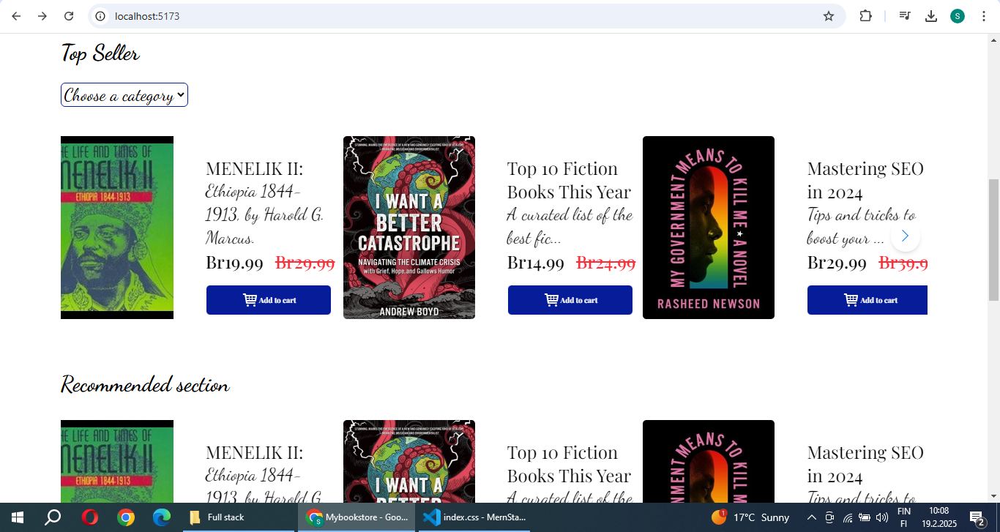

# Book Store app
Hi 👋, My name is Selamsew i am React and PHP developer  developer, good at Mern Stack development.
## Overview

A book-selling website forntend that allows users to browse, search, and discover a wide range of books. Built with React and styled using Tailwind CSS, this platform offers an intuitive and seamless shopping experience for book lovers, featuring detailed book descriptions, categories, and easy navigation.

## Technologies Used

1. React – For building the user interface

2. Tailwind CSS – For styling and responsiveness

3. Google and DaFont - for font styles

## Installation

1. Clone the repository:

> git clone https://github.com/selamde/BookStoreApp.git

2. Navigate to the project folder:

> cd fontend

3. Install dependencies:

> npm install

5. Enter the command:
npm run dev

## Usage

- Open the app in your browser at http://localhost:5173/

  

## App looks like this

- Desktop view

- Mobile view

